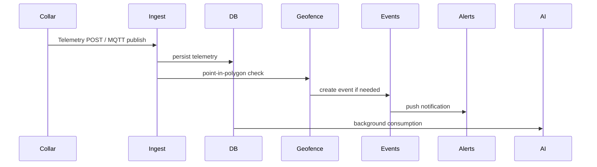

# Technical architecture

This document describes the system architecture for PastureOS v0.

System overview
- Collar devices send telemetry (HTTP or MQTT) to a telemetry ingest endpoint.
- Telemetry stored in a geospatial-capable store (Postgres + PostGIS recommended).
- A geofence engine evaluates point-in-polygon checks and boundary distances.
- Event engine generates alerts and logs into the database.
- Dashboard consumes telemetry and event streams for live view and pilot reporting.
- AI/analytics consume historical data for rule-based anomaly detection and future ML training.

Collar-to-cloud data flow (Mermaid)

Telemetry ingestion
- HTTP POST `/telemetry/ingest` with signed payloads (future)
- Accept payload: animal_id, collar_id, timestamp, lat, lon, accuracy, battery_level, connectivity_status, activity_level, temperature_trend, firmware_version, event_type

Geofence engine
- Geofence stored as polygon (GeoJSON)
- Point-in-polygon operation (PostGIS ST_Contains or in-code ray-casting fallback)
- Compute distance to boundary for warning zone

Event engine
- Generates typed events (LOCATION_UPDATE, APPROACHING_BOUNDARY, AUDIO_CUE_TRIGGERED, PULSE_TRIGGERED, BOUNDARY_BREACH, ESCAPE_ALERT, LOW_BATTERY, CONNECTIVITY_DROPOUT, ANOMALY_FLAGGED, MANUAL_OVERRIDE_ENABLED, TRAINING_MODE_ENABLED)

Alerting
- Real-time push via WebSocket / server-sent events and optional SMS/email integrations.

Dashboard
- Map center with animal markers, live updates, fence editing, event timeline, pilot scorecard export.

AI monitoring layer
- Rule-based first (z-score, rolling windows), then supervised models with vet-labelled data.

Data storage
- Primary store: Postgres + PostGIS for spatial indexing
- Cache/queue: Redis for push and job queue

Security assumptions
- Device identity: collars have unique IDs and long-term device keys (future)
- API auth: JWT for users, scoped tokens for devices
- GDPR: data minimisation, retention policies, and opt-outs

Failure modes
- GPS drift: tolerance and low-confidence handling
- Connectivity loss: device buffers telemetry for resend
- Hardware failure: health heartbeats and replacement workflow

Scalability roadmap
- Start with single-tenant DB for pilot; migrate to multi-tenant sharding and time-series stores for large scale.
